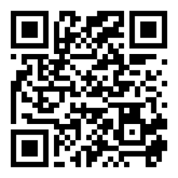
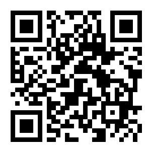

```{r setup, include=FALSE}
knitr::opts_chunk$set(
  echo    = FALSE,
  warning = FALSE,
  message = FALSE,
  comment = "",
  fig.align = "left"
  )

here::i_am("assignments/zoobio/Behavior/behavior_lab1.Rmd")
```

# Instructions

## Choose your Video Stream

Select **any two** of the video streams available at the San Diego Zoo or the Smithsonian National Zoo (links below). You may want to browse a few different options before you **find two** that your group prefers to focus on today.





## Conduct an Ad Lib Observation

>**IMPORTANT**: During this step you should not compare notes or discuss with your group. Everyone should work independently and silently while watching the same video stream. *The point of this first round will be to compare your observations among each other at the end.*

1.  Start a timer and watch your live stream continuously for 10 minutes while trying to record every behavioral detail you see. **Do not discuss or collaborate with your group yet, but make sure you all coordinate watching the same 10-minute stream.**

  - While you watch and write, you should aim to document every behavior that you think may be valuable for assessing the animal's welfare and overall mental state.
  
2.  Repeat the same process for your other video stream on a different species.
  
3.  After completing both 10-minute sessions, stop and compare your results with your group.

  a.  How easy or challenging were each of the animals to watch and follow? Were you able to record all the details that you wanted to without missing anything important?

\vspace{0.1cm}
\noindent\rule{\textwidth}{0.4pt}
\vspace{0.1cm}
\noindent\rule{\textwidth}{0.4pt}

  b.  How similar or different were your group members' approaches and results? Did you all focus on the same or different behaviors? Were some of you more or less detailed/precise in your documentation?

\vspace{0.1cm}
\noindent\rule{\textwidth}{0.4pt}
\vspace{0.1cm}
\noindent\rule{\textwidth}{0.4pt}

  c.  What strengths/weaknesses would this approach present if you were trying to maintain a reliable, long-term record of animal wellbeing?

\vspace{0.1cm}
\noindent\rule{\textwidth}{0.4pt}
\vspace{0.1cm}
\noindent\rule{\textwidth}{0.4pt}

  d.  How might you present these results for broader consumption by the rest of the animal caregivers or healthcare providers?

\vspace{0.1cm}
\noindent\rule{\textwidth}{0.4pt}
\vspace{0.1cm}
\noindent\rule{\textwidth}{0.4pt}
  
\newpage

## Draft an Ethogram

Background on ethograms

>For the next step, you should once again switch to watching the video streams **independently without collaboration** before comparing your results.

**Now you should select one of the two video streams to focus on. You will watch that video stream for 20 minutes with the goal of identifying at least 10-15 mutually exclusive behaviors.**

1.  List each behavior and jot down a description/definition for the behavior.

  - Your definition **cannot include the behavior name/title** and it should **clearly distinguish that behavior from all others**.
  - Your ulimate goal is to describe these behaviors such that a naiive observer could identify them immediately on first observation without needing explaination or demonstration from you.
    - *This may not be possible on your first attempt, so just do your best as you jot down a rough list and description of 10+ behaviors.*
    
2.  At the end of the 20-minute interval, compare results with your group members.

  a.  How similar or different were the behaviors that your group identified/described?

\vspace{0.1cm}
\noindent\rule{\textwidth}{0.4pt}
\vspace{0.1cm}
\noindent\rule{\textwidth}{0.4pt}

3.  Discuss whether you would categorize each behavior as a **state** or **event.**

>**State:** A relatively stable or continuous condition or mode of behavior that an organism is in for a certain period of time. *(Examples include sleeping, resting, grooming, or feeding.)*
>**Event:** A specific, discrete behavior or occurrence at a particular time. *(Examples include vocalizing, interacting with a specific object, or engaging in a certain social behavior.)*
>>**Note:** *Some behaviors will clearly fall under one or the other category, while others could count as both, depending on how you are observing/analyzing.*

\newpage

## Context for Next Steps

**Now your group will work together to create an improved and more refined ethogram for your target species. You will watch the video stream for another 20 minutes, again with the goal of identifying at least 10-15 mutually exclusive behaviors**

  - This time, you should have a better idea of how many behaviors your group aims to identify and describe.
  - You may also start with a few behaviors you all agreed were clearly important during the first round and aim to revise/improve the definitions.

### Tips for Creating Ethograms

When you decide upon the list of behaviors to record, or ethogram, you should follow some general principles.  These primarily apply to recording behaviors using interval and continuous methods but are helpful to consider for any sampling approach.

- **Behaviors should be mutually exclusive.**  When scoring behavior, you should only record one behavior at a time.  If an animal performs several behaviors, for instance, walking and eating, you’ll need to define which behavior is the more important to record and stay consistent with that priority.

- **The behavior list should be exhaustive.** You should always be able to score something and should never intentionally leave missing values when recording behavior.  When animals go out of sight or perform a behavior you haven’t defined, your results could contain significant gaps.  You should include Other and Not Visible choices in your ethogram to address this.

- **Behavior definitions should be objective.**  How you define the behavior should be based primarily on the physical description of behavior and not on the perceived (potentially subjective) context. Even play behaviors, similar to hunting or social behaviors, typically have subtle physical differences to distinguish these contexts.

## Collaborative Ethogram Construction

>For the next step, you should fully collaborate as a group to draft a single document while watching a video stream for your target species again. I recommend everyone record descriptions individually so that you can combine that work into one document after your observation.
  
1.  As you watch another 20-minute video, work on a collaborative version of the same document as before.

2.  After you are finished, decide as a group how you would like to categorize those behaviors in a standardized protocol moving forward *(i.e., event or state)*.

3.  Decide on broader categories (examples included below) that you might use to classify the behaviors on your list. Then assign one class to each behavior.

### Defining Behavior Categories

Defining broad behavior categories to group an ethogram conceptually can be helpful.  
  
Some examples of categories you’ll see in the Lincoln Park Zoo Master Ethogram include Inactive, Feeding/ Foraging/ Drinking, Locomotion, Undesirable, Other Solitary, Social, and Not Visible.  
  
Behavior categories can help train new observers on the ethogram by highlighting relationships between different behaviors and making an ethogram with many behaviors more manageable.   
  
In addition, you might need to add or remove behaviors during your study.  Although this can make comparing individual behaviors before and after this change challenging, you may still be able to compare broader behavior categories.  For instance, you may have started with one behavior called Feeding but later want to specify different foraging types like Browsing and Grazing.  By grouping several behaviors in the same category, you can compare the time spent feeding/foraging more broadly.  

  
## Looking Forward

Next we will explore the tools available for documenting and quantifying observations of the behaviors you have identified today. The more exhaustive and precise your ethogram is, the better prepared you will be to carry out the next steps, so take care to construct an ethogram you are happy with before you go.

