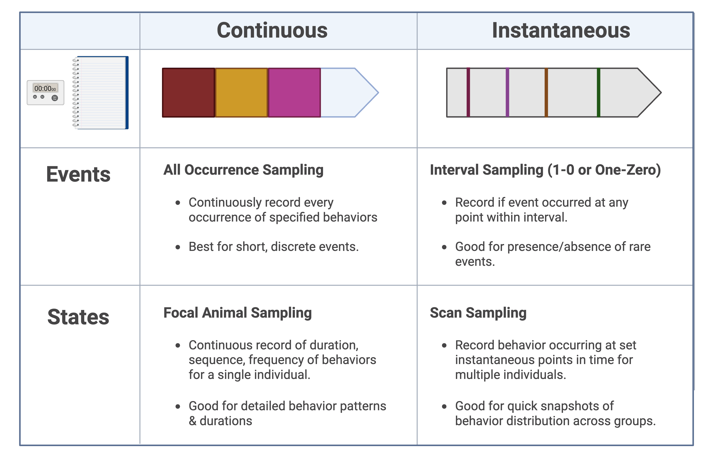

```{r setup, include=FALSE}
knitr::opts_chunk$set(
  echo    = FALSE,
  warning = FALSE,
  message = FALSE,
  comment = "",
  fig.align = "left"
  )

here::i_am("assignments/zoobio/Behavior/behavior_lab2.Rmd")
library(qrcode)
library(knitr)
library(bookdown)
library(conflicted)
library(gt)
library(here)
library(htmltools)
library(plotly)
library(png)
library(reactable)
library(reactablefmtr)
library(rmarkdown)
library(scales)
library(shiny)
library(showtext)
library(thematic)
library(tidyverse)
library(tippy)
library(usethis)
```

## Introduction

Building upon your recent behavioral observations and ethogram construction, this week's assignment challenges your group to critically apply these skills to evaluate animal welfare and enrichment effectiveness. You'll design a behavioral monitoring protocol specifically targeting your fictional zoo's special exhibit animals and the enrichment items you recently created.

Additionally, this assignment includes finalizing your physical enrichment items and integrating your semester's work into your Google Site portfolio, aiming to attract potential stakeholder investment.

## Assignment Objectives

- Formulate a clear welfare or enrichment-related hypothesis or research question.
- Determine which behaviors from your ethogram are most relevant to your hypothesis.
- Design a data collection protocol including sampling methods and data sheets.
- Prepare a structured data entry spreadsheet.
- Complete construction of your animal enrichment items.
- Update your zoo's Google Site with your complete welfare assessment plan, enrichment item documentation, and overall semester work.

## Step-by-Step Instructions

### Step 1: Formulate a Research Question or Hypothesis

Identify a clear objective focused either on assessing animal welfare or evaluating the effectiveness of your enrichment items. Clearly state your question or hypothesis:

- *Example*: Does the introduction of our enrichment item reduce pacing behavior in clouded leopards?

### Step 2: Refine Your Ethogram

From your earlier ethogram, select 5-8 behaviors that are specifically relevant to your research question/hypothesis. Revise behavior definitions if necessary, ensuring they are precise, objective, and mutually exclusive. Think about whether you will want to report each behavior's **duration**, **frequency**, **latency**, etc. This should determine your approach to the next step.

### Step 3: Select Sampling Methods

Choose an appropriate sampling approach:

- **Continuous (Focal Animal Sampling)**: Record all occurrences of selected behaviors for one animal over a set period.
- **Instantaneous (Scan Sampling)**: Record behaviors at predetermined intervals (e.g., every 30 seconds or every minute).

Justify your choice based on your research objective and logistical considerations.



### Step 4: Design Data Collection Sheets

Create clear, user-friendly data collection sheets for observers. Include:

- Animal ID/Name
- Date and time
- Behaviors listed clearly with space or columns for recording occurrences
- Clearly marked time intervals (for instantaneous sampling)
- Observer name

Include a draft/example of your data collection sheet in your Google Site.

>**Note:** You may opt to propose using an app or other electronic resource if you prefer. I will provide QR codes and links below to a few suggestions that you can check out if you are curious.

```{r echo=FALSE, out.width="50%"}
apps <- tibble(
  name = c("BORIS (Behavioral Observation Research Interactive Software)",
           "Zoo Monitor",
           "Animal Observer",
           "Animal Behaviour Pro",
           "BOT (Behavioral Observation Tool)",
           "CyberTracker"),
  link = c("https://www.boris.unito.it/",
           "https://zoomonitor.org/",
           "https://fosseyfund.github.io/AOToolBox/",
           "https://research.kent.ac.uk/lprg/software/",
           "https://www.simontonsoftware.com/BOT",
           "https://cybertracker.org/")
) %>%
  gt(rowname_col = "name") %>%
  fmt_url(columns = "link") %>%
  opt_stylize(style = 3, color = "gray") %>%
  tab_stubhead("Observation Apps") %>%
  cols_label(link ~ "") %>%
  cols_align(align = "left") %>%
  cols_width(
    stub() ~ "300px",
    link   ~ "100px"
  )
apps
```


### Step 5: Create a Data Entry Spreadsheet

Prepare a spreadsheet template (Google Sheets or Excel) for efficient data entry and subsequent analysis. It should include:

- Columns for animal, observer, date, and session details
- Columns for behaviors (clearly labeled)
- Rows for data entry aligned logically with your observation protocol

Include an example screenshot or a link to your spreadsheet in your Google Site.

### Step 6: Finalize Your Animal Enrichment Item

- Complete the physical construction of your enrichment item.
- Photograph your finished enrichment item clearly and attractively.
- On your Google Site, create a dedicated page featuring these photographs along with detailed information:
  - Purpose and intended animal use
  - Materials used
  - Any special design considerations for animal safety or welfare

### Step 7: Improve and Update Your Zoo Google Site Portfolio

This is your opportunity to revisit your portfolio and integrate or highlight elements from all lessons and assignments you've completed this semester. Consider the following:

- Clearly present your project's goals and accomplishments to attract potential stakeholder investment.
- Ensure your site is professional, engaging, and easy to navigate.
- Highlight key learning outcomes, designs, and assessments prominently.

## Submission Checklist

- [ ] Welfare/enrichment research question or hypothesis
- [ ] Refined, relevant ethogram
- [ ] Justification of chosen sampling method
- [ ] Example data collection sheet
- [ ] Structured data entry spreadsheet
- [ ] Completed enrichment item with photographs and detailed information
- [ ] Updated and improved Google Site portfolio featuring semester highlights

